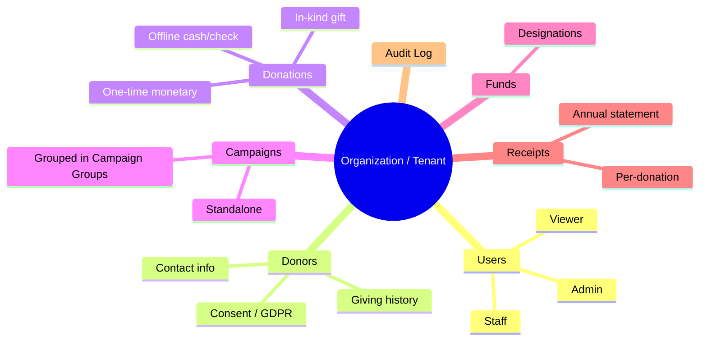
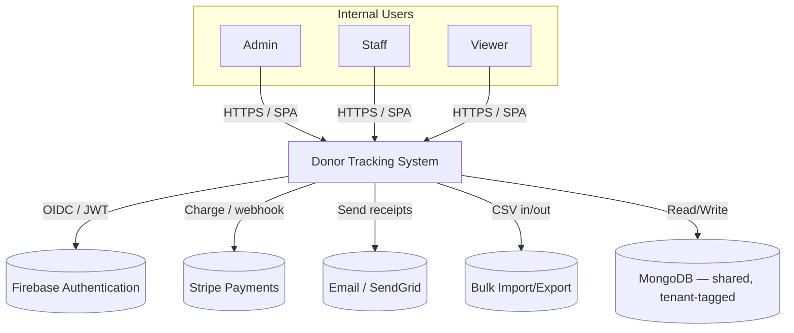

# 00 — System Overview

## 1. Purpose

A **multi-tenant SaaS** application that lets nonprofit organizations track **donors**,
record **donations**, organize donations into **campaigns** (optionally grouped), and run the
back-office workflows around giving: **reporting**, **tax receipts**, **online payments**,
**bulk data import/export**, and **audit/compliance**.

Each customer organization is a **tenant**. All tenant data lives in a shared database and
shared collections, isolated logically by a `tenantId` field and enforced by the application.

## 2. Goals & non-goals

### Goals
- Single source of truth for donor contact info and giving history, per organization.
- Fast, role-appropriate access for internal staff (Admin / Staff / Viewer).
- Compliant handling of PII with field-level access control and audit trails.
- Actionable insight: dashboards, campaign/fund performance, donor retention.
- Automate receipting (per-donation and annual) and accept online payments.

### Non-goals (this phase)
- No public/donor-facing login or self-service portal.
- No general ledger / accounting system replacement (export/integrate instead).
- No recurring billing engine yet (data model accommodates it; see roadmap).

## 3. Personas & roles

| Persona | Role | Typical tasks | Sensitive data access |
|---------|------|---------------|-----------------------|
| Development Director | **Admin** | Configure org, manage users, templates, refunds, GDPR requests | Full |
| Gift Officer / Bookkeeper | **Staff** | Add/edit donors & donations, run campaigns, issue receipts | Masked by default, reveal-with-audit |
| Board Member / Analyst | **Viewer** | Read dashboards & reports, export summaries | Read-only, PII masked |

Users are **internal only**. A user may belong to **multiple organizations**; after signing in
they select the active organization (auto-selected when they belong to just one), and their role
is **scoped to that organization**. Roles drive both page-level and **field-level** access
(e.g., a Viewer never sees a donor's full tax ID or bank reference).

## 4. Core domain concepts

## 5. System context (C4 Level 1)

## 6. Quality attributes (drivers)

| Attribute | Target / approach |
|-----------|-------------------|
| **Security & privacy** | Field-level RBAC, PII encryption at rest, full audit log, GDPR erase/export |
| **Tenant isolation** | Mandatory `tenantId` filter in a single data-access choke point |
| **Usability** | Task-oriented React UI, optimistic updates via TanStack Query |
| **Reliability** | Idempotent payment webhooks, receipt generation retries |
| **Portability (demo)** | Backend fully mockable so the SPA runs with zero infrastructure |
| **Extensibility** | Donation/campaign model open to recurring & pledges without migration |

## 7. Glossary

| Term | Meaning |
|------|---------|
| **Tenant / Organization** | A customer nonprofit; the isolation boundary for all data |
| **Donor** | A person or organization that gives; stores contact + consent info |
| **Donation** | A single gift (monetary, offline, or in-kind) attributed to a donor |
| **Campaign** | A collection of donations toward a goal/timeframe |
| **Campaign Group** | An optional grouping of campaigns (e.g., "2026 Annual Appeal") |
| **Fund / Designation** | Where money is directed (e.g., "Scholarship Fund") |
| **Receipt / Statement** | Tax document: per-donation receipt or annual consolidated statement |
| **In-kind gift** | A non-cash donation recorded at fair-market valuation |

See [Architecture](./01-architecture.md) next.
