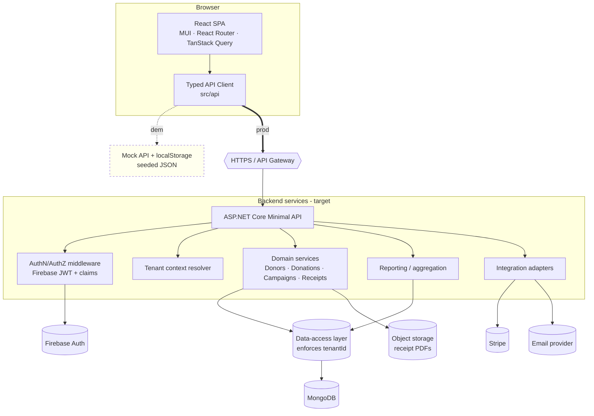
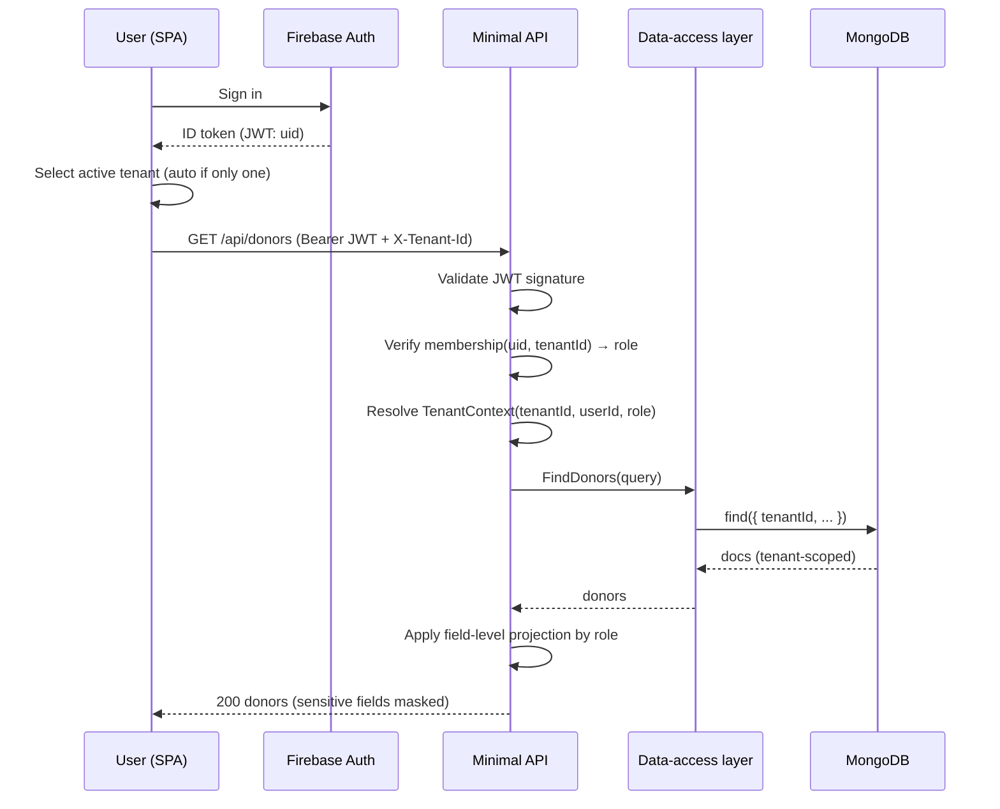
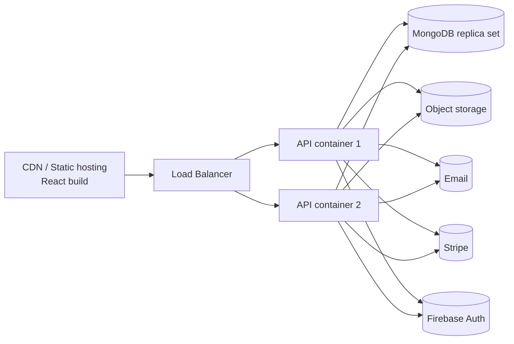
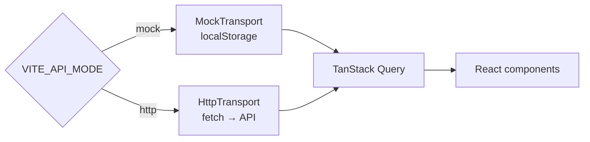

# 01 — Architecture

## 1. Architectural style

- **Client:** Single-Page Application (React SPA) — thick client, server-agnostic via a typed
  API client.
- **Server (target):** ASP.NET Core **minimal API**, stateless, horizontally scalable behind a
  load balancer.
- **Data:** MongoDB, **pooled multi-tenancy** (shared DB + shared collections + `tenantId`).
- **Auth:** Firebase Authentication as the identity provider; the API validates Firebase ID
  tokens and reads `tenantId` / `role` custom claims.
- **Demo:** the entire server + DB is replaced by an in-browser **mock API** module (see
  [Mock Strategy](./06-mock-strategy.md)). The React app does not know the difference.

## 2. Logical architecture (C4 Level 2 — Containers)



## 3. Technology stack

| Layer | Technology | Notes |
|-------|-----------|-------|
| UI framework | React 19 + TypeScript + Vite | Already scaffolded in this repo |
| Component lib | MUI (`@mui/material`, `@mui/x-charts`) | Data tables, forms, charts |
| Routing | React Router | Nested layouts per feature area |
| Server state | TanStack Query | Caching, optimistic updates, retries |
| API contract | REST + JSON, OpenAPI-described | Typed client generated/handwritten in `src/api` |
| Backend (target) | ASP.NET Core minimal API (.NET) | Stateless, containerized |
| Database | MongoDB | Shared collections, `tenantId` indexed |
| Auth | Firebase Authentication | ID token (JWT) with custom claims |
| Payments | Stripe | Payment Intents + webhooks |
| Email | SendGrid (or SMTP) | Receipt delivery |
| PDF | Server-side renderer (e.g., QuestPDF) | Receipt & statement generation |
| Object storage | S3/Azure Blob | Stores generated PDFs |

## 4. Request lifecycle (production)



The two **non-negotiable choke points** are:
1. **Tenant scoping** — every query passes through the data-access layer which injects
   `tenantId`. No service method may query MongoDB directly.
2. **Field-level projection** — responses are shaped by role before leaving the API.

## 5. Deployment view (target)



- Stateless API containers → scale horizontally.
- MongoDB replica set for HA; indexes on `{ tenantId, ... }` for every hot query.
- Static SPA served from CDN; environment flag switches the API client between **mock** and
  **live** transports.

## 6. Frontend module structure

Maps onto the existing repo layout (`src/api`, `src/components`, `src/hooks`, `src/routes`):

```
src/
  api/         # Typed client + transport (mock | http), DTOs, query keys
  routes/      # Route components per feature (donors, donations, campaigns, reports…)
  components/  # Reusable UI (tables, forms, charts, PII field, role guards)
  hooks/       # useDonors, useDonations, useAuth, useTenant, useReport…
  assets/
```

## 7. Environment switch (demo vs. live)



A single environment variable selects the transport; all UI, hooks, and query logic are
identical in both modes. This keeps the demo faithful to the production design.

Next: [Data Model](./02-data-model.md).
