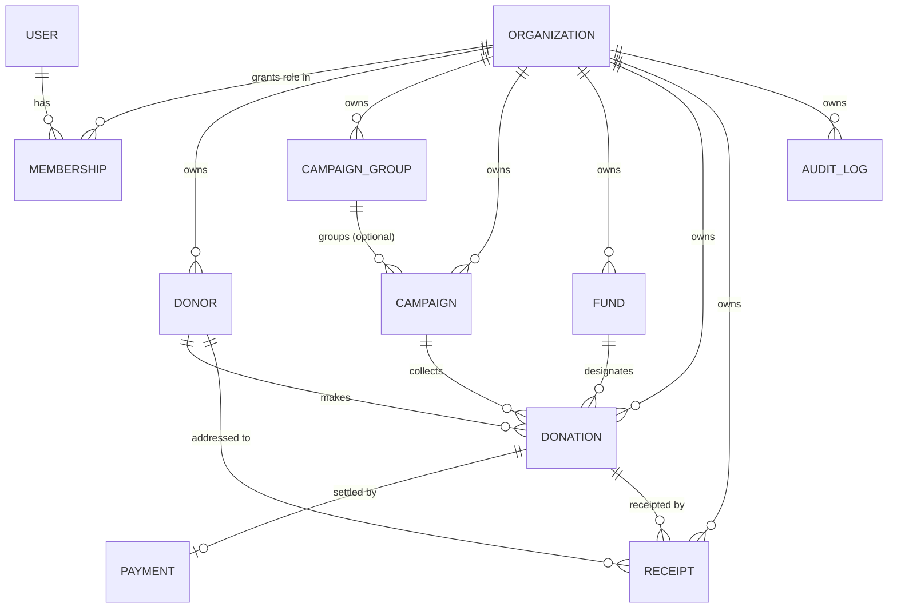
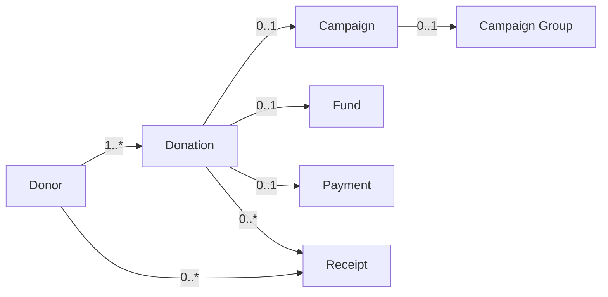

# 02 — Data Model

Tenant-scoped collections are **shared across tenants**; every such document carries a
`tenantId`. The data-access layer always filters and stamps `tenantId` (see
[Multi-Tenancy & Security](./03-multitenancy-security.md)). Two identity collections are the
exception: **`users`** are **global** (a person can belong to many organizations) and
**`memberships`** is the user↔tenant join that assigns a per-tenant role.

## 1. Entity-relationship diagram

> The diagram shows cardinality only; field detail is below. A campaign **may** belong to a
> campaign group (grouped) or stand alone (`campaignGroupId = null`).

## 2. Collections & key fields

Common fields on **every** tenant-scoped document: `_id`, `tenantId`, `createdAt`, `updatedAt`,
`createdBy`, `updatedBy`. The global `users` collection omits `tenantId`.

### `organizations` (tenants)
| Field | Type | Notes |
|-------|------|-------|
| `_id` | ObjectId | Also the `tenantId` used everywhere |
| `name`, `legalName` | string | |
| `taxId` | string (encrypted) | Charity/EIN number |
| `address` | object | Used on receipts |
| `branding` | object | Logo, colors for receipt templates |
| `receiptSettings` | object | Per-org templates, reply-to email, disclaimers |
| `status` | enum | active / suspended |

### `users` (global identity — no `tenantId`)
| Field | Type | Notes |
|-------|------|-------|
| `firebaseUid` | string | Links to Firebase identity (one per person) |
| `email`, `displayName` | string | |
| `status` | enum | active / disabled (account-level) |
| `defaultTenantId` | ObjectId \| null | Optional last-used / preferred tenant |
| `lastLoginAt` | date | |

> A user is **not** bound to one organization. Their organizations and per-org roles live in
> `memberships`.

### `memberships` (user ↔ tenant join)
| Field | Type | Notes |
|-------|------|-------|
| `userId` | ObjectId | → `users` |
| `tenantId` | ObjectId | → `organizations` |
| `role` | enum | `Admin` \| `Staff` \| `Viewer` — **scoped to this tenant** |
| `status` | enum | invited / active / disabled |
| `invitedBy`, `invitedAt` | ref / date | Provisioning trail |

> Uniqueness on `{ userId, tenantId }`. A person may be `Admin` in one org and `Viewer` in
> another; the active tenant selected after login determines the effective role.

### `donors`
| Field | Type | Sensitivity |
|-------|------|-------------|
| `type` | enum | `individual` \| `organization` |
| `firstName`, `lastName`, `orgName` | string | Normal |
| `emails[]`, `phones[]` | array | Normal |
| `addresses[]` | array | Normal |
| `taxId` / `ssnLast4` | string (encrypted) | **Sensitive** — Admin only |
| `consent` | object | `{ emailOptIn, gdprBasis, consentAt, source }` |
| `gdpr` | object | `{ erasureRequestedAt, exportedAt, status }` |
| `tags[]` | string[] | Segmentation |
| `lifetimeValue` | number (derived) | Denormalized rollup |
| `firstGiftAt`, `lastGiftAt` | date (derived) | For retention/lapsed reports |

### `campaign_groups`
| Field | Type | Notes |
|-------|------|-------|
| `name`, `description` | string | e.g., "2026 Annual Appeal" |
| `startDate`, `endDate` | date | Optional |

### `campaigns`
| Field | Type | Notes |
|-------|------|-------|
| `name`, `description` | string | |
| `campaignGroupId` | ObjectId \| null | **null = standalone** |
| `goalAmount` | number | For progress tracking |
| `startDate`, `endDate` | date | |
| `status` | enum | draft / active / closed |
| `raisedAmount` | number (derived) | Rollup for dashboards |

### `funds` (designations)
| Field | Type | Notes |
|-------|------|-------|
| `name`, `code` | string | e.g., "Scholarship Fund" |
| `isRestricted` | bool | Restricted vs. unrestricted |

### `donations`
| Field | Type | Notes |
|-------|------|-------|
| `donorId` | ObjectId | Required |
| `campaignId` | ObjectId \| null | Optional membership in a campaign |
| `fundId` | ObjectId \| null | Optional designation |
| `type` | enum | `monetary_online` \| `offline_cash_check` \| `in_kind` |
| `amount` | number | Monetary value (money types) |
| `currency` | string | ISO code |
| `inKind` | object \| null | `{ description, fairMarketValue, valuationMethod }` |
| `receivedAt` | date | Gift date (drives receipting/reporting) |
| `method` | enum | card / cash / check / other |
| `checkNumber` | string \| null | Offline reference |
| `status` | enum | recorded / settled / refunded / voided |
| `paymentId` | ObjectId \| null | Link to `payments` (online only) |
| `receiptId` | ObjectId \| null | Latest per-donation receipt |
| `isTaxDeductible` | bool | Affects receipts |
| `note` | string | |
| **Deferred hooks** | | `recurringPlanId`, `pledgeId` reserved (see roadmap) |

### `payments` (Stripe settlement)
| Field | Type | Notes |
|-------|------|-------|
| `donationId` | ObjectId | |
| `gateway` | enum | `stripe` |
| `gatewayRef` | string | Payment Intent id |
| `status` | enum | requires_action / succeeded / failed / refunded |
| `amount`, `currency`, `fee` | number | |
| `rawEventIds[]` | string[] | For idempotent webhook handling |

### `receipts`
| Field | Type | Notes |
|-------|------|-------|
| `kind` | enum | `per_donation` \| `annual_statement` |
| `donorId` | ObjectId | |
| `donationIds[]` | ObjectId[] | 1 for per-donation, many for annual |
| `taxYear` | number | For annual statements |
| `pdfUrl` | string | Object-storage location |
| `number` | string | Sequential per org/year |
| `emailStatus` | enum | pending / sent / failed |
| `issuedAt` | date | |

### `audit_logs`
| Field | Type | Notes |
|-------|------|-------|
| `actorUserId` | ObjectId | Who |
| `action` | enum | create / update / delete / view_sensitive / export / login |
| `entityType`, `entityId` | string | What |
| `changes` | object | Redacted before/after diff |
| `ip`, `userAgent` | string | Context |
| `at` | date | When (immutable, append-only) |

## 3. Relationships & aggregate boundaries

- **Donation** is the transactional aggregate root; it references donor, campaign, fund.
- **Campaign ↔ Campaign Group** is optional and one level deep (a group contains campaigns;
  campaigns are not nested in each other).
- **Derived rollups** (`donor.lifetimeValue`, `campaign.raisedAmount`) are maintained on write
  and recomputable from `donations` (source of truth).

## 4. Indexing strategy (MongoDB)

Every index is **compound, `tenantId`-first** so tenant filtering uses the index:

| Collection | Index | Serves |
|------------|-------|--------|
| donors | `{ tenantId, lastName, firstName }` | List/search |
| donors | `{ tenantId, lastGiftAt }` | Retention/lapsed reports |
| donations | `{ tenantId, receivedAt }` | Dashboards, date ranges |
| donations | `{ tenantId, donorId, receivedAt }` | Donor giving history |
| donations | `{ tenantId, campaignId }` | Campaign performance |
| campaigns | `{ tenantId, campaignGroupId }` | Group rollups |
| receipts | `{ tenantId, donorId, taxYear }` | Annual statements |
| audit_logs | `{ tenantId, at }` | Compliance queries |
| users | `{ firebaseUid }` (unique) | Identity lookup on login |
| memberships | `{ userId }` | List a user's organizations (tenant picker) |
| memberships | `{ tenantId, role }` · unique `{ userId, tenantId }` | Manage an org's members |

## 5. Modeling note — recurring & pledges (deferred)

The model reserves `recurringPlanId` and `pledgeId` on `donations`. When enabled, add
`recurring_plans` (schedule, amount, next run) and `pledges` (committed amount, installments)
collections. Existing donation records remain valid — **no migration required**, satisfying the
"accommodated in the model" requirement.

Next: [Multi-Tenancy & Security](./03-multitenancy-security.md).
