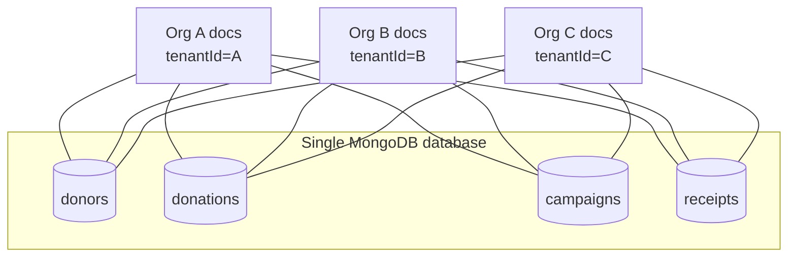
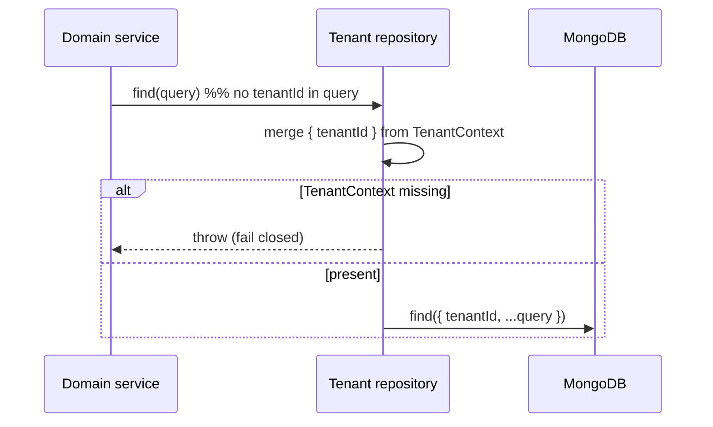
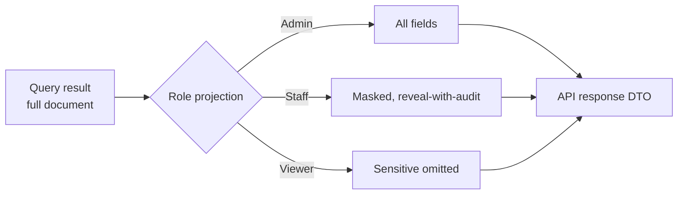
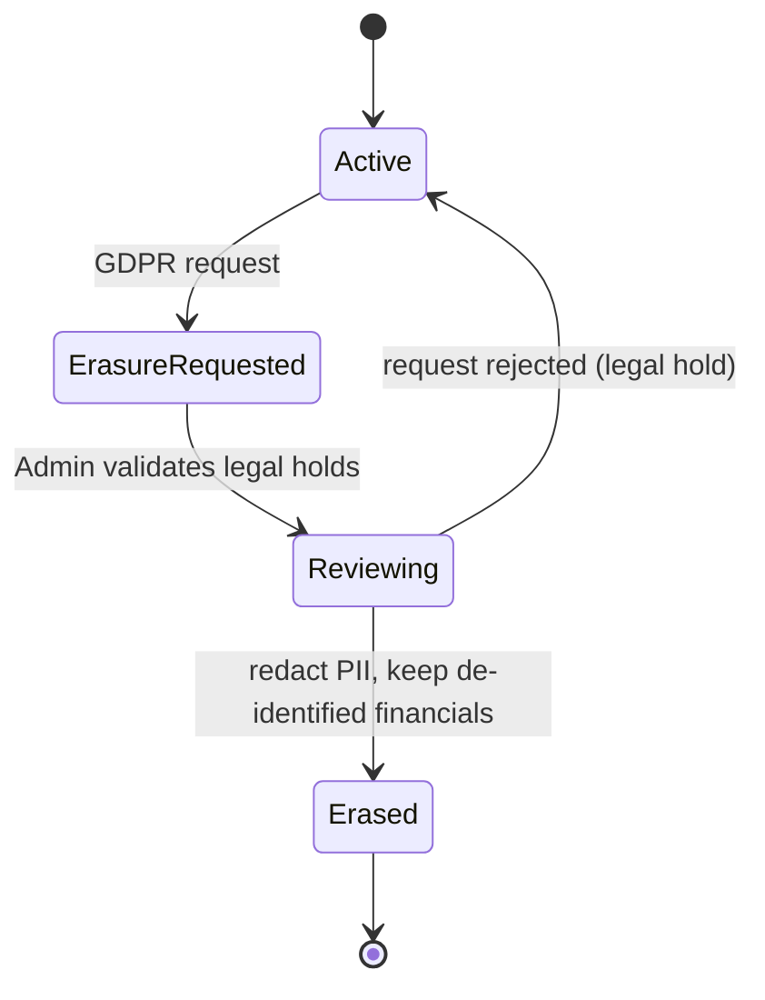

# 03 — Multi-Tenancy & Security

## 1. Tenancy model

**Pooled multi-tenancy: shared database, shared collections, `tenantId` discriminator.**



**Rationale:** simplest and most cost-effective; one connection pool, one schema, easy
cross-tenant operations for platform admins. **Trade-off:** isolation is *logical*, enforced by
the application — so enforcement must be centralized and hard to bypass.

### Isolation guardrails
1. **Single data-access choke point.** All reads/writes go through a repository layer that
   *requires* a `TenantContext` and injects `{ tenantId }` into every filter and every insert.
   Domain services cannot call the Mongo driver directly.
2. **Never trust client-supplied `tenantId` blindly.** The active tenant arrives in the
   `X-Tenant-Id` header but is only honored after verifying the caller has an **active
   membership** for it; the effective role is read from that membership, not from the client.
3. **Compound indexes are `tenantId`-first** so scoping is also a performance guarantee.
4. **Defense in depth (optional):** a per-tenant field-level encryption key so a query bug can't
   leak *readable* sensitive data across tenants.
5. **Automated tests** assert that queries without a tenant filter throw.



## 2. Authentication & tenant selection (Firebase)

- Firebase Authentication is the IdP. Users sign in (email/password or SSO configured in
  Firebase); the SPA receives a **Firebase ID token (JWT)** that identifies the **person**
  (`uid`) — it does **not** carry a tenant or role.
- A user can belong to **multiple organizations**. Their organizations and per-org roles live in
  the `memberships` collection (see [Data Model](./02-data-model.md)).
- **After login the user selects an active tenant.** If they have exactly one active membership
  it is auto-selected; otherwise they choose. The choice is remembered (`users.defaultTenantId`).
- Each API request carries the active tenant in an **`X-Tenant-Id`** header. The API validates
  the JWT signature, then looks up `membership(uid, X-Tenant-Id)`; if an **active** membership
  exists it builds `TenantContext { tenantId, userId, role }` from that membership's role.
  No active membership → `403`.
- The role is therefore **always derived server-side from the membership**, never trusted from
  the client, and **switching tenants** simply changes the header — no re-login required.

```mermaid
sequenceDiagram
    participant SPA
    participant FB as Firebase Auth
    participant API
    SPA->>FB: signInWithEmailAndPassword()
    FB-->>SPA: ID token (claim: uid only)
    SPA->>API: GET /me/memberships (Bearer token)
    API-->>SPA: [{ tenantId, orgName, role }, ...]
    Note over SPA: Auto-select if one; else user picks
    SPA->>API: GET /donors (Bearer token + X-Tenant-Id)
    API->>API: verify signature + exp + aud
    API->>API: lookup membership(uid, tenantId) → role (else 403)
    API->>API: build TenantContext { tenantId, userId, role }
    API-->>SPA: authorized, tenant-scoped response
```

## 3. Authorization — RBAC

Three roles, coarse capability matrix:

| Capability | Admin | Staff | Viewer |
|------------|:-----:|:-----:|:------:|
| View dashboards & reports | ✅ | ✅ | ✅ |
| Export CSV/reports | ✅ | ✅ | ➖ summary only |
| Create/edit donors & donations | ✅ | ✅ | ❌ |
| Delete / void / refund | ✅ | ➖ request | ❌ |
| Issue receipts | ✅ | ✅ | ❌ |
| Configure org, templates, funds | ✅ | ❌ | ❌ |
| Manage users & roles | ✅ | ❌ | ❌ |
| Bulk import | ✅ | ➖ | ❌ |
| Reveal sensitive PII fields | ✅ | ➖ reveal-with-audit | ❌ |
| Handle GDPR erase/export | ✅ | ❌ | ❌ |

Enforced in **two places**: API endpoint policies (authoritative) and UI route/element guards
(UX only, never the security boundary).

## 4. Field-level access to sensitive data

Certain fields (donor `taxId`/`ssnLast4`, bank/check references, full payment refs) are
**classified sensitive**. The API applies a **role-based projection** before returning data:



- **Admin:** full values.
- **Staff:** masked by default (`•••• 1234`); an explicit **reveal** action calls a dedicated
  endpoint that returns the value **and writes a `view_sensitive` audit entry**.
- **Viewer:** sensitive fields are omitted from the DTO entirely.

Masking happens **server-side**; the SPA never receives values a role may not see.

## 5. PII protection & compliance (GDPR)

| Control | Approach |
|---------|----------|
| **Encryption at rest** | Sensitive fields encrypted (field-level); DB volume encryption |
| **Encryption in transit** | TLS everywhere |
| **Data minimization** | Only classify/collect what's needed for receipting & contact |
| **Right to access** | GDPR **export**: full donor data package (JSON/CSV) on request |
| **Right to erasure** | GDPR **erase**: PII redacted; financial records retained per tax law but de-identified (`donorId` → tombstone) |
| **Consent tracking** | `donor.consent` records basis, source, timestamp |
| **Retention** | Configurable retention windows; audit logs immutable & retained separately |
| **Audit** | Every sensitive view/export/change is logged (see below) |



## 6. Audit logging

- **Append-only** `audit_logs` collection; no update/delete via the app.
- Captures actor, action, entity, redacted diff, IP/user-agent, timestamp.
- Written by the same repository layer that enforces tenancy, so it can't be skipped.
- Surfaced to Admins in a **searchable audit view** (see [Features](./04-features.md)).

## 7. Threat model highlights (OWASP-aligned)

| Risk | Mitigation |
|------|-----------|
| **Broken access control / IDOR** | Central tenant filter + endpoint policies; object ids scoped by tenant |
| **Cross-tenant leakage** | Fail-closed repository; optional per-tenant encryption keys |
| **Sensitive data exposure** | Field-level projection + encryption + reveal auditing |
| **Injection** | Parameterized Mongo queries via driver; input validation/DTOs |
| **Broken auth** | Firebase-issued JWTs, short-lived tokens, signature/aud/exp checks |
| **CSRF** | Bearer tokens (no ambient cookies) for API calls |
| **Webhook spoofing** | Verify Stripe signature; idempotent event handling |
| **Insufficient logging** | Mandatory, immutable audit trail |

Next: [Features](./04-features.md).
