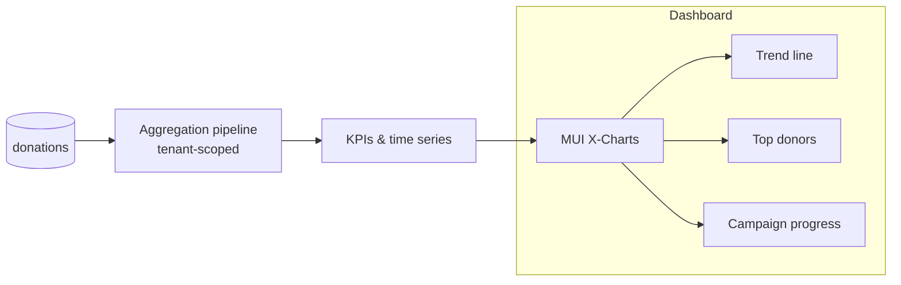
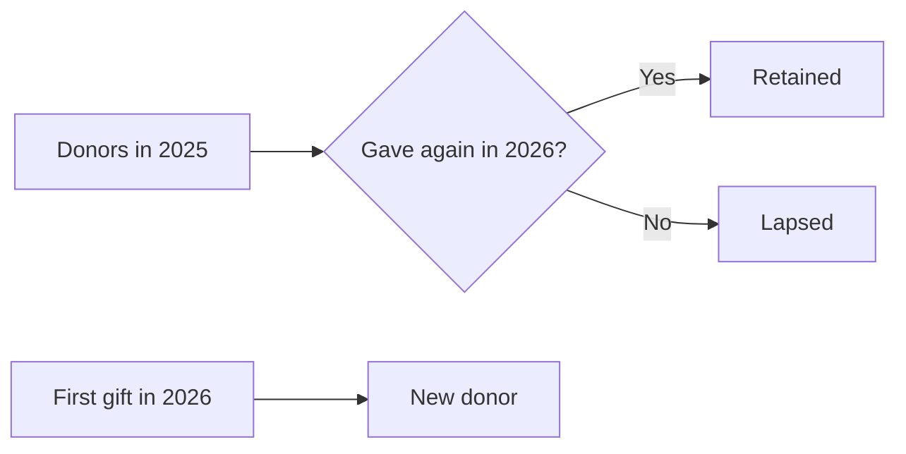
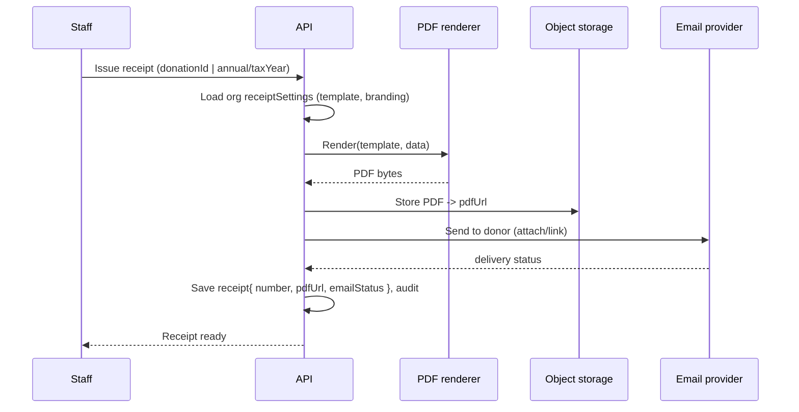
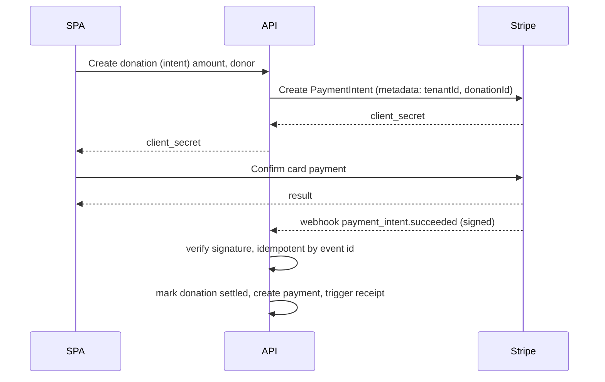
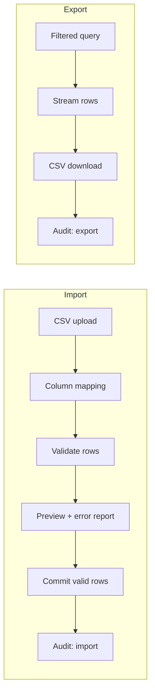
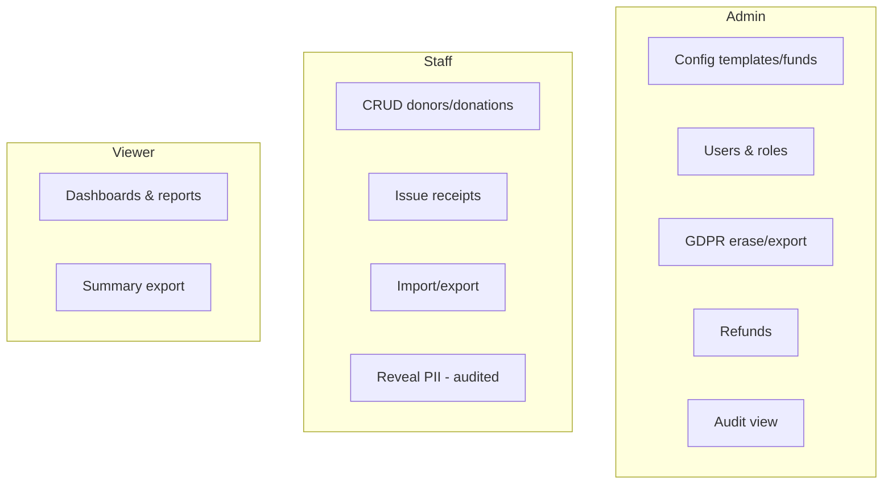

# 04 — Features

Beyond CRUD for donors, donations, campaigns, groups, and funds, the system provides five
capability areas. Each is designed to work identically over the **live API** or the **demo mock**.

## 1. Reporting & dashboards

### Reports in scope
| Report | Content | Primary users |
|--------|---------|---------------|
| **Overview dashboard** | Totals (today/MTD/YTD), giving trend, top donors, recent gifts | All |
| **Campaign / fund performance** | Raised vs. goal, donor count, avg gift, by group | Admin/Staff |
| **Donor retention / lapsed** | New vs. returning, retention %, lapsed (no gift in N months) | Admin/Staff |

### Data flow

- Server-side **MongoDB aggregation** computes KPIs and time buckets (always `tenantId`-first).
- Results cached via TanStack Query; date-range and campaign/fund filters are query params.
- **Retention** = donors who gave in period *P* and also in *P-1*; **lapsed** = last gift older
  than a configurable window (derived from `donor.lastGiftAt`).

### Retention concept

## 2. Tax receipt generation (PDF + email)

Two document kinds, per-org configurable templates:

| Kind | Trigger | Contents |
|------|---------|----------|
| **Per-donation receipt** | On donation record/settle (auto or manual) | Single gift, amount, date, deductibility, in-kind valuation |
| **Annual consolidated statement** | Year-end batch per donor | All deductible gifts in tax year, totals |

- **Templates** are per-org (`organizations.receiptSettings`): logo, header/footer, legal
  disclaimer, reply-to.
- **Numbering** is sequential per org + tax year.
- **Idempotency & retries:** email failures are retryable; the PDF is stored regardless so it can
  be re-sent or downloaded.
- **Annual statements** run as a batch job over the tax year's deductible donations grouped by
  donor.

## 3. Payment gateway integration (Stripe)

Scope: **one-time monetary** online gifts. (Offline cash/check and in-kind are recorded
manually and skip the gateway.)

- **Webhook is the source of truth** for settlement (not the client result).
- **Signature verification** + **idempotency** on Stripe event ids (`payments.rawEventIds`).
- Refunds update `donation.status = refunded` and are audited.
- In the **demo**, the mock simulates the PaymentIntent + a delayed "webhook" callback.

## 4. Bulk import / export (CSV)

- **Import:** donors and/or donations; user maps CSV columns to fields; rows are validated with a
  **preview** and per-row error report before commit. Partial success allowed; failures
  downloadable for correction.
- **Export:** any filtered list (donors, donations, campaign results). **Sensitive fields are
  subject to the same role projection** — Viewers get summary/non-PII exports only.
- Every import/export writes an audit entry (who, what, row counts).

## 5. Audit logging & compliance

- Central, **append-only** audit trail (design in
  [Multi-Tenancy & Security §6](./03-multitenancy-security.md)).
- **Admin audit view:** searchable/filterable by actor, action, entity, date.
- **GDPR tooling:** per-donor **export** (data package) and **erase** (redact PII, retain
  de-identified financials for tax compliance) with a review/approval step.
- **Consent** captured on donors and honored by communications (receipt emails respect opt-in
  where legally required).

### Feature-to-role summary

Next: [API Design](./05-api-design.md).
