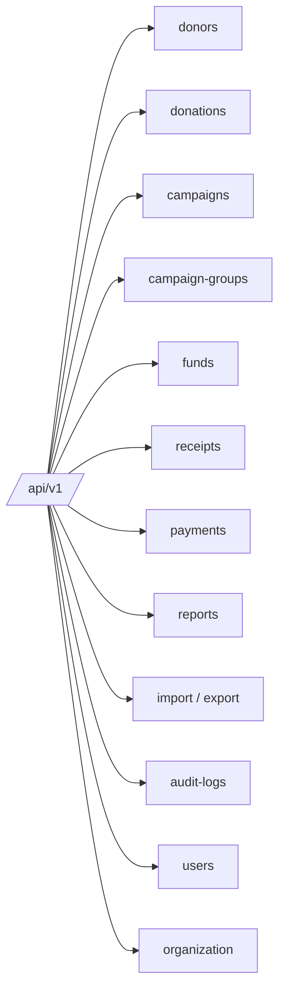
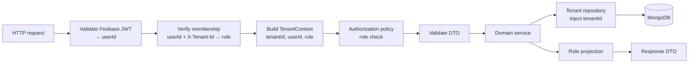

# 05 — API Design

REST + JSON over HTTPS, described by OpenAPI. The React app talks to this contract through a
**typed client** (`src/api`) whose transport is either the live HTTP API or the demo mock — the
resource shapes are identical.

## 1. Conventions

- **Base path:** `/api/v1`.
- **Auth:** `Authorization: Bearer <Firebase ID token>` on every request (identifies the user).
- **Active tenant:** sent per request in the **`X-Tenant-Id`** header. The API honors it only
  after verifying the caller has an **active membership** for that tenant, and derives the role
  from that membership — never from the URL or body.
- **IDs:** opaque strings (Mongo ObjectId hex).
- **Pagination:** `?page`, `?pageSize` (or cursor); responses include `total`, `page`, `pageSize`.
- **Filtering/sorting:** `?q=`, resource-specific filters, `?sort=field:asc`.
- **Field projection:** applied by role server-side; sensitive fields masked/omitted.
- **Idempotency:** unsafe external ops (payments) support `Idempotency-Key`.
- **Errors:** RFC 7807 problem+json.

```json
{
  "type": "https://errors.donortrack/validation",
  "title": "Validation failed",
  "status": 400,
  "detail": "amount must be > 0",
  "traceId": "…",
  "errors": { "amount": ["must be greater than 0"] }
}
```

## 2. Resource map



## 3. Endpoint catalog (representative)

| Method & path | Purpose | Min role |
|---------------|---------|:--------:|
| `GET /donors` | List/search donors | Viewer |
| `POST /donors` | Create donor | Staff |
| `GET /donors/{id}` | Get donor (role-projected) | Viewer |
| `PATCH /donors/{id}` | Update donor | Staff |
| `DELETE /donors/{id}` | Delete/void donor | Admin |
| `POST /donors/{id}/reveal` | Reveal a sensitive field (audited) | Staff |
| `GET /donors/{id}/donations` | Donor giving history | Viewer |
| `GET /donations` | List donations (filters: date, campaign, fund, type) | Viewer |
| `POST /donations` | Record donation (offline/in-kind or start online) | Staff |
| `PATCH /donations/{id}` | Edit / void / refund | Staff/Admin |
| `GET /campaigns` · `POST /campaigns` | Campaign CRUD | Viewer / Staff |
| `GET /campaign-groups` · `POST …` | Group CRUD | Viewer / Admin |
| `GET /funds` · `POST /funds` | Fund CRUD | Viewer / Admin |
| `POST /payments/intent` | Create Stripe PaymentIntent | Staff |
| `POST /payments/webhook` | Stripe webhook (no user auth; signature-verified) | — |
| `POST /receipts` | Issue per-donation receipt | Staff |
| `POST /receipts/annual` | Generate annual statements (batch) | Admin |
| `GET /receipts/{id}/pdf` | Download receipt PDF | Viewer |
| `GET /reports/dashboard` | KPIs + time series | Viewer |
| `GET /reports/campaign-performance` | Campaign/fund performance | Viewer |
| `GET /reports/retention` | Retention / lapsed | Staff |
| `POST /import/donors` · `/import/donations` | Bulk CSV import (validate → commit) | Admin/Staff |
| `GET /export/{resource}` | CSV export (role-projected) | Viewer+ |
| `GET /audit-logs` | Search audit trail | Admin |
| `GET /me/memberships` | List the caller's organizations + roles (tenant picker) | any authenticated |
| `PATCH /me/default-tenant` | Set preferred / last-used tenant | any authenticated |
| `GET/POST /users` | Manage this org's members (memberships) & roles | Admin |
| `DELETE /users/{id}/membership` | Remove a user from the active org | Admin |
| `POST /gdpr/{donorId}/export` · `/erase` | GDPR data subject requests | Admin |
| `GET/PATCH /organization` | Org profile & receipt settings | Admin |

## 4. Request pipeline (server)



## 5. Example — record an in-kind donation

```http
POST /api/v1/donations
Authorization: Bearer <token>
Content-Type: application/json

{
  "donorId": "665f…",
  "campaignId": "664a…",
  "fundId": null,
  "type": "in_kind",
  "currency": "USD",
  "inKind": {
    "description": "Auction: signed guitar",
    "fairMarketValue": 1200,
    "valuationMethod": "appraisal"
  },
  "receivedAt": "2026-06-01",
  "isTaxDeductible": true,
  "note": "Gala donation"
}
```

Response `201`: the created donation with server-stamped `tenantId`, `status: "recorded"`, and
audit entry written.

## 6. Versioning & compatibility

- URI versioning (`/v1`) for breaking changes; additive fields are backward-compatible.
- The mock and live transports share DTO types, so the demo exercises the real contract.

Next: [Mock Backend Strategy](./06-mock-strategy.md).
