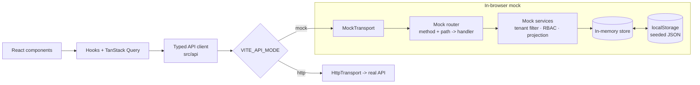
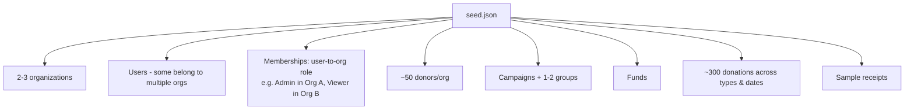
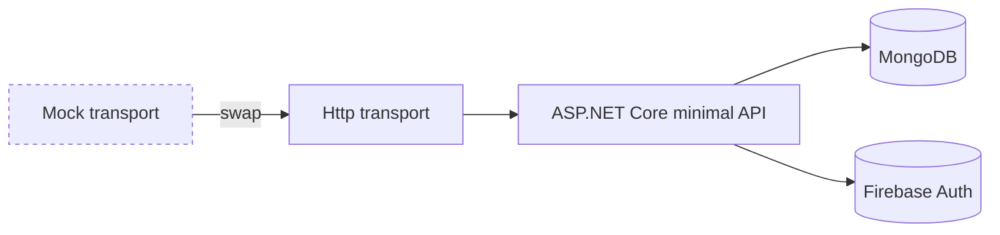

# 06 — Mock Backend Strategy (Demo)

For the portfolio demo there is **no server**. The backend is simulated in the browser so the
SPA is fully interactive and shareable as a static site. The mock faithfully implements the
[API contract](./05-api-design.md), including multi-tenancy, RBAC, and field-level projection —
so the demo *demonstrates the real design*, not a shortcut.

## 1. Approach

**In-memory mock API + seeded JSON, persisted to `localStorage`.**

Only the **transport** changes. Components, hooks, query keys, and DTO types are identical to
production, so switching to the live API later is a config flip.

## 2. What the mock simulates

| Concern | Mock behavior |
|---------|---------------|
| **Auth** | A fake login selects a seeded user; the mock returns that user's `memberships`. If one, the tenant is auto-selected; if many, a **tenant picker** appears. The active `{ tenantId, role }` (role from the chosen membership) forms the in-memory `TenantContext`. A "Switch role" control still aids demoing RBAC. |
| **Multi-tenancy** | Seed contains 2–3 orgs and users with **memberships across several orgs**; every mock query filters by the active `tenantId`. A top-bar **tenant switcher** re-scopes instantly, proving isolation. |
| **RBAC + field projection** | Mock services apply the same role matrix and mask/omit sensitive fields per role. |
| **Latency** | Small artificial delay so loading/optimistic states are visible. |
| **Errors** | Deterministic error cases (validation, forbidden) to exercise UI error paths. |
| **Payments** | `POST /payments/intent` returns a fake client secret; a `setTimeout` simulates the Stripe webhook flipping the donation to `settled`. |
| **Receipts/PDF** | Generates a client-side placeholder PDF/blob URL and a fake "email sent" status. |
| **Import/export** | Parses/serializes CSV in-browser with the same validation/preview flow. |
| **Audit** | Writes audit entries into the mock store, viewable in the Admin audit screen. |
| **Persistence** | State is hydrated from seeded JSON on first load and saved to `localStorage`; a "Reset demo data" action restores the seed. |

## 3. Seed data

Donations span a range of dates and all three types (monetary, offline cash/check, in-kind) so
dashboards, trends, retention, and campaign performance all render meaningfully.

## 4. Mapping to the repo

| Path | Role |
|------|------|
| `src/api/client.ts` | Public typed client used by hooks |
| `src/api/transport/http.ts` | Live transport (fetch) |
| `src/api/transport/mock/` | Mock router, services, store, seed |
| `src/api/types.ts` | Shared DTOs (used by both transports) |
| `src/hooks/` | `useDonors`, `useDonations`, `useAuth`, `useReport`, … |
| `.env` | `VITE_API_MODE=mock \| http` |

## 5. Fidelity vs. simplicity

**Kept faithful** (they showcase the design): tenant filtering, RBAC, field-level masking,
audit writes, the donation/receipt/payment lifecycles.

**Deliberately simplified** (not the point of a demo): real cryptography, real Stripe/SendGrid
calls, server-side PDF rendering fidelity, concurrency/transactions.

## 6. Path to production

Because both transports honor the same contract and behaviors, replacing the mock with the real
API requires no changes to components or hooks — only wiring real auth tokens and the base URL.

Next: [UI & Information Architecture](./07-ui-ia.md).
