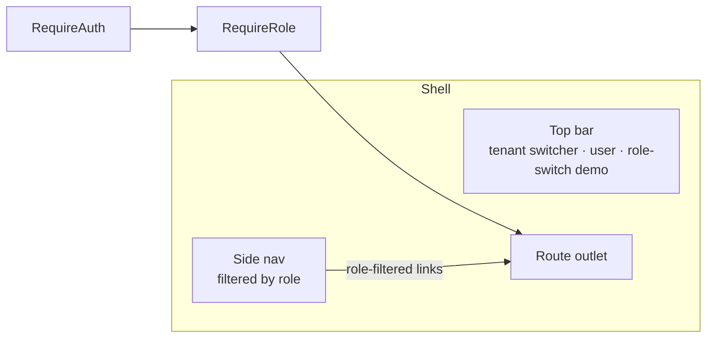
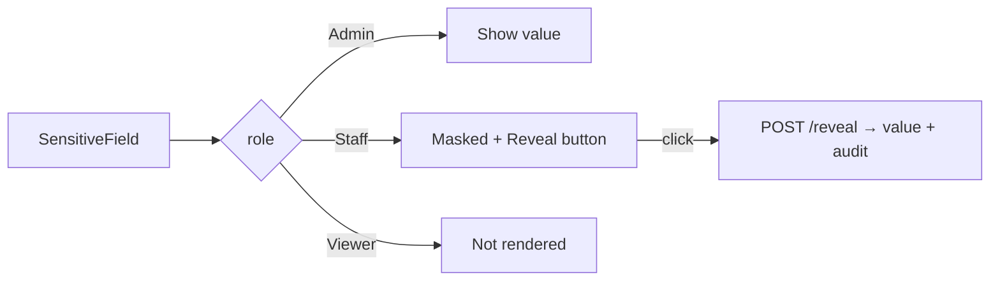
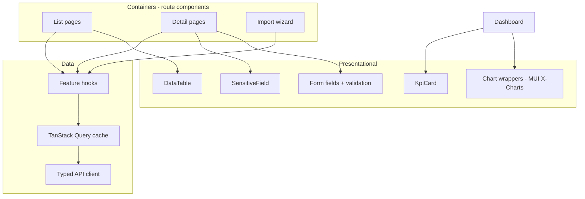
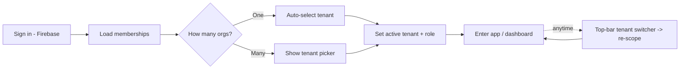
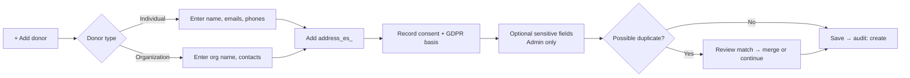
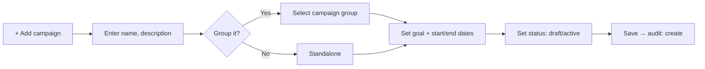
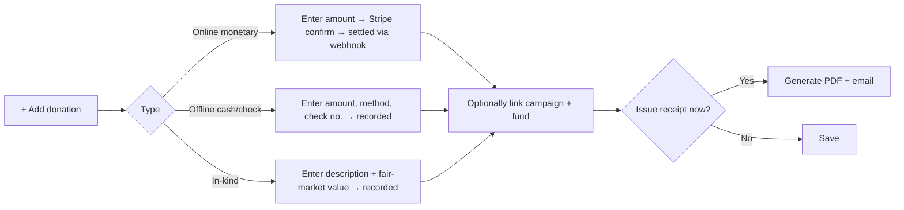
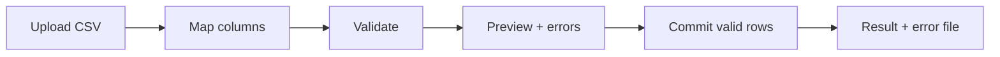

# 07 — UI & Information Architecture

React 19 + TypeScript + Vite, MUI components, React Router for navigation, TanStack Query for
server state. Layout is a persistent app shell (top bar + side nav) with feature areas as nested
routes.

## 1. Navigation map

```mermaid
flowchart TB
    LOGIN[/login/] --> SELECT[/select-tenant/<br/>auto-skip if single membership]
    SELECT --> SHELL[App shell<br/>active tenant + role aware]
    SHELL --> DASH[/dashboard/]
    SHELL --> DONORS[/donors/]
    DONORS --> DONOR[/donors/:id/]
    SHELL --> DONATIONS[/donations/]
    DONATIONS --> DONATION[/donations/:id/]
    SHELL --> CAMPAIGNS[/campaigns/]
    CAMPAIGNS --> CAMPAIGN[/campaigns/:id/]
    CAMPAIGNS --> GROUPS[/campaigns/groups/]
    SHELL --> FUNDS[/funds/]
    SHELL --> RECEIPTS[/receipts/]
    SHELL --> REPORTS[/reports/]
    SHELL --> IMPORT[/data/import-export/]
    SHELL --> AUDIT[/admin/audit/]
    SHELL --> SETTINGS[/admin/settings/]
    SHELL --> USERS[/admin/users/]
```

Admin-only routes (`/admin/*`) are guarded; unauthorized roles never see the nav entries and are
redirected if they deep-link.

After sign-in the user lands on **tenant selection**. If they have exactly one active membership
it is auto-selected and the screen is skipped; otherwise they pick an organization. The chosen
tenant becomes the **active tenant** for the session and can be changed anytime from the top-bar
tenant switcher, which re-scopes all data and the effective role.

## 2. Screen inventory

| Route | Screen | Key elements | Min role |
|-------|--------|--------------|:--------:|
| `/select-tenant` | Tenant selection | List of the user's organizations + role; auto-skip if only one | any authenticated |
| `/dashboard` | Overview | KPI cards, giving trend, top donors, recent gifts, filters | Viewer |
| `/donors` | Donor list | Search, filters, table, quick-add | Viewer (edit: Staff) |
| `/donors/:id` | Donor detail | Profile, masked PII w/ reveal, giving history, receipts, consent/GDPR | Viewer |
| `/donations` | Donation list | Filters (date/type/campaign/fund), table, add donation | Viewer |
| `/donations/:id` | Donation detail | Type-specific fields, payment/receipt status, void/refund | Viewer |
| `/campaigns` | Campaign list | Progress vs. goal, group chips, status | Viewer |
| `/campaigns/:id` | Campaign detail | Performance, donations, donors | Viewer |
| `/campaigns/groups` | Groups | Group list + rollups, assign campaigns | Viewer (edit: Admin) |
| `/funds` | Funds | List, restricted flag | Viewer (edit: Admin) |
| `/receipts` | Receipts | Issue per-donation, run annual batch, delivery status | Staff |
| `/reports` | Reports | Campaign/fund performance, retention/lapsed, export | Viewer |
| `/data/import-export` | Bulk data | CSV upload → map → validate → preview → commit; exports | Staff/Admin |
| `/admin/audit` | Audit log | Searchable trail | Admin |
| `/admin/settings` | Org settings | Receipt templates, branding, funds config | Admin |
| `/admin/users` | Users | Invite, assign roles, disable | Admin |

## 3. App shell & guards



- `RequireAuth` gates all app routes; `RequireRole` gates admin/edit actions.
- Guards are **UX only** — the API is the real security boundary
  ([Security](./03-multitenancy-security.md)).

## 4. Sensitive field component



A single reusable `<SensitiveField>` component encapsulates masking/reveal and calls the audited
reveal endpoint, keeping PII handling consistent across screens.

## 5. Component architecture



## 6. Key UX flows

### Sign in & choose organization



### Add a donor



### Add a campaign



### Add a donation



### Bulk import



## 7. Responsiveness & accessibility

- MUI responsive grid; tables collapse to card lists on small screens.
- Keyboard-navigable forms/tables, ARIA labels, sufficient color contrast for chart palettes.
- Loading/empty/error states standardized via shared components and TanStack Query status.

Next: [Roadmap & Decisions](./08-roadmap-decisions.md).
