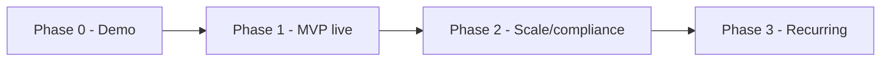

# 08 — Roadmap & Key Decisions

## 1. Delivery phasing

| Phase | Scope |
|-------|-------|
| **0 — Demo (this repo)** | React SPA + mock backend; donors, donations (all 3 types), campaigns/groups/funds, dashboards, receipts (client stub), CSV import/export, audit view, RBAC + field masking with seed data |
| **1 — MVP (live)** | ASP.NET Core minimal API + MongoDB; Firebase auth; real Stripe one-time payments; real PDF + email receipts; per-donation + annual statements |
| **2 — Scale & compliance** | GDPR export/erase workflows, encryption at rest, retention policies, advanced reports, background jobs for annual statements |
| **3 — Recurring & pledges** | Enable reserved `recurringPlanId`/`pledgeId`; add `recurring_plans` + `pledges` collections; scheduled charges |

## 2. Deferred items (accommodated in the model)

| Deferred | How it's accommodated |
|----------|-----------------------|
| Recurring donations | `donation.recurringPlanId` reserved; add `recurring_plans` later — no migration |
| Pledges | `donation.pledgeId` reserved; add `pledges` (committed + installments) later |
| Donor self-service portal | Auth model (Firebase) can add a separate donor audience later |
| Multi-currency settlement | `currency` stored per donation; settlement/FX added later |

## 3. Cross-cutting concerns

| Concern | Approach |
|---------|----------|
| Observability | Structured logs + `traceId` on every response; audit trail is separate |
| Config | Per-env; `VITE_API_MODE` switches mock/live transport |
| Testing | Repository tenant-scoping tests (fail-closed), RBAC/projection tests, mock-backed UI tests |
| Migrations | Additive schema; derived rollups recomputable from `donations` |
| Backups/DR | MongoDB replica set + snapshots (production) |

## 4. Architecture Decision Records (summary)

### ADR-001 — Pooled multi-tenancy (shared DB & collections, `tenantId`)
- **Decision:** shared database, shared collections, `tenantId` discriminator with app-level
  filtering.
- **Why:** simplest and most cost-effective; single schema/pool; easy platform-wide operations.
- **Trade-off:** logical (not physical) isolation → mitigated by a single fail-closed data-access
  choke point, `tenantId`-first indexes, and optional per-tenant field encryption.
- **Alternatives:** DB-per-tenant / collection-per-tenant (stronger isolation, higher cost &
  ops) — rejected for this stage.

### ADR-002 — Firebase Authentication
- **Decision:** Firebase as IdP; the ID token (JWT) identifies the **user** (`uid`) only — it
  does **not** carry tenant or role. ASP.NET Core validates the signature.
- **Why:** managed auth, fast to integrate, SSO-capable, offloads credential handling; keeping
  tenant/role out of the token supports multi-tenant membership and instant tenant switching.
- **Trade-off:** external dependency; the API resolves role per request from `memberships`.

### ADR-003 — ASP.NET Core minimal API + MongoDB
- **Decision:** minimal API over MongoDB (document model fits donors/donations; "collections"
  map naturally).
- **Why:** lightweight, fast, strong .NET tooling; flexible schema for evolving gift types.

### ADR-004 — Mock backend in-browser (in-memory + seeded JSON + localStorage)
- **Decision:** simulate the full API contract client-side for the demo.
- **Why:** zero-infra, shareable static demo that still showcases tenancy, RBAC, field masking,
  and full lifecycles; swappable for the real API via one config flag.

### ADR-005 — Field-level access control server-side
- **Decision:** sensitive fields masked/omitted by role in the API (and mock); reveal is a
  separate audited action.
- **Why:** clients must never receive data a role can't see; consistent, auditable PII handling.

### ADR-006 — Stripe webhooks as settlement source of truth
- **Decision:** treat signed, idempotent webhooks (not client results) as authoritative for
  payment settlement.
- **Why:** reliability and correctness against dropped clients/retries.

### ADR-007 — Users may belong to multiple tenants; active tenant chosen after login
- **Decision:** `users` is a **global** identity; a `memberships` collection joins users to
  organizations with a **per-tenant role**. After login the user selects an active tenant
  (auto-selected when they have a single membership). The active tenant travels in the
  **`X-Tenant-Id`** request header and is validated against `memberships` server-side.
- **Why:** consultants, shared staff, and multi-entity nonprofits need one login across orgs,
  with a role scoped per organization.
- **Trade-off:** an extra (cacheable) membership lookup per request; `users` is the one
  collection without a `tenantId`.
- **Alternatives:** encoding all memberships in JWT custom claims — rejected (claim size, goes
  stale on role change, and requires a token refresh to switch tenants).

## 5. Open questions / future decisions

- Email provider choice (SendGrid vs. SES) and deliverability domain setup.
- PDF library and template authoring UX for per-org receipt templates.
- Whether platform-super-admin (cross-tenant) tooling is needed and how it's isolated.
- Data residency requirements per customer (may pressure the pooled model later).

Back to the [index](./README.md).
